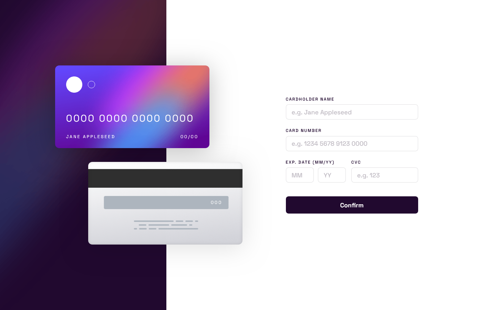

# Frontend Mentor - Interactive card details form solution

This is a solution to the [Interactive card details form challenge on Frontend Mentor](https://www.frontendmentor.io/challenges/interactive-card-details-form-XpS8cKZDWw).

## Overview

### The challenge

Users should be able to:

- Fill in the form and see the card details update in real-time
- Receive error messages when the form is submitted if:
  - Any input field is empty
  - The card number, expiry date, or CVC fields are in the wrong format
- View the optimal layout depending on their device's screen size
- See hover, active, and focus states for interactive elements on the page

### Screenshot

### Links

- Solution URL: [GitHub repository](https://github.com/Whiskydog/frontendmentor-interactive-card-details-form)
- Live Site URL: [GitHub Pages site](https://whiskydog.github.io/frontendmentor-interactive-card-details-form/)

## My process

### Built with

- Semantic HTML5 markup
- Mobile-first workflow
- Flexbox
- [CSS Modules](https://github.com/css-modules/css-modules/)
- [Vite](https://vitejs.dev/) - Fast development environment
- [React](https://reactjs.org/) - JS library
- [react-hook-form](https://react-hook-form.com/0) - Extensible form library

### What I learned

I learned how to use react-hook-form for building forms and provide easy validation.

Also utilized CSS Modules to the best of my abilities for encapsulation of CSS styles. Although please feel free to provide any feedback on my frontendmentor profile, it's my first time using CSS Modules. Vite.js really streamlines this process because [it supports Modules out of the box](https://vitejs.dev/guide/features.html#css-modules).

I'm still getting a grasp of media queries to implement responsive design.

I was somewhat learned on React.js before this project, however it always amazes me its flexibility. Keeping the card component in sync with the form inputs was fairly straightforward thanks to React.

### Useful resources

I always make sure to check documentation:

- [react-hook-form API](https://react-hook-form.com/docs)
- [CSS Modules docs](https://github.com/css-modules/css-modules)
- [React.js Learn](https://react.dev/learn)

Also this is an useful series of articles for dipping your toes in CSS Modules:

1. [What are CSS Modules and why do we need them?](https://css-tricks.com/css-modules-part-1-need/)
2. [Getting Started with CSS Modules](https://css-tricks.com/css-modules-part-2-getting-started/)
3. [CSS Modules and React](https://css-tricks.com/css-modules-part-3-react/)

## Author

- Website - [Whiskydog GitHub Pages site](https://whiskydog.github.io)
- Frontend Mentor - [@Whiskydog](https://www.frontendmentor.io/profile/Whiskydog)
- Twitter - [@whiskydog](https://www.twitter.com/whiskydog)
